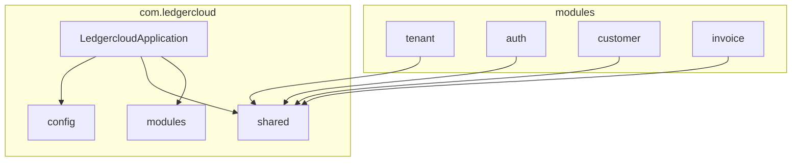
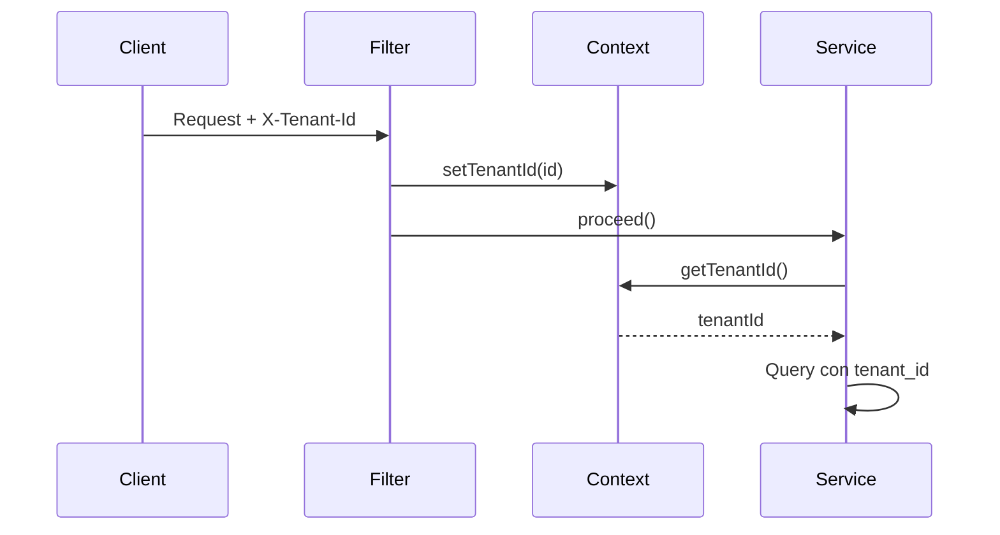
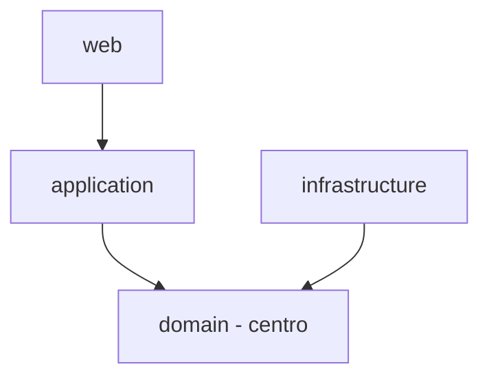

# Plan: Arquitectura SaaS  para Ledgercloud

## Estado actual

- Proyecto casi vacío: solo [LedgercloudApplication.java](src/main/java/com/ledgercloud/ledgercloud/LedgercloudApplication.java)
- Stack: Spring Boot 4, Vaadin 25, PostgreSQL, RabbitMQ, Redis, Spring Security, JPA
- Paquete actual: `com.ledgercloud.ledgercloud` (redundante)

---

## 1. Nuevo paquete raíz

```
com.ledgercloud
```

Sin duplicar el nombre. Todo bajo `com.ledgercloud.*`.

---

## 2. Estructura objetivo (vista general)




---

## 3. Orden de implementación (orden exacto)


| Fase  | Módulo/Área          | Razón                                        |
| ----- | -------------------- | -------------------------------------------- |
| **1** | Config + Shared base | Base técnica antes de dominio                |
| **2** | Tenant               | Base multi-tenant antes de cualquier dominio |
| **3** | Auth + Security      | Autenticación y tenancy integrados           |
| **4** | Customer             | Dominio simple para validar flujo            |
| **5** | Invoice              | Dominio central, ya con patrones definidos   |


---

## 4. Fase 1: Config y Shared base

### 4.1 Config ([config/](src/main/java/com/ledgercloud/config/))

- `DatabaseConfig.java` – JPA, datasource (si hace falta algo extra)
- `RedisConfig.java` – Redis (ya conectado vía Spring AI)
- `RabbitConfig.java` – RabbitMQ
- `OpenApiConfig.java` – Swagger/OpenAPI (opcional)

### 4.2 Shared ([shared/](src/main/java/com/ledgercloud/shared/))

- `exceptions/BusinessException.java` – excepción de dominio
- `exceptions/GlobalExceptionHandler.java` – `@ControllerAdvice`
- `util/` – utilidades comunes (vacío por ahora)

---

## 5. Fase 2: Módulo Tenant (crítico)

### 5.1 Estructura del módulo tenant

```
modules/tenant/
├── domain/
│   ├── model/
│   │   ├── Tenant.java          (entidad raíz)
│   │   └── TenantStatus.java    (enum)
│   ├── repository/
│   │   └── TenantRepository.java (interface)
│   └── service/
│       └── TenantDomainService.java
├── application/
│   ├── usecase/
│   │   ├── CreateTenantUseCase.java
│   │   └── GetTenantUseCase.java
│   └── dto/
│       ├── CreateTenantRequest.java
│       └── TenantResponse.java
├── infrastructure/
│   └── persistence/
│       ├── TenantEntity.java
│       └── JpaTenantRepository.java
└── web/
    └── controller/
        └── TenantController.java  (REST, para admin)
```

### 5.2 Shared: tenancy

- `shared/tenancy/TenantContext.java` – `ThreadLocal` con tenant actual
- `shared/tenancy/TenantFilter.java` – extrae tenant de header/subdomain/JWT y pone en contexto

### 5.3 Estrategia multi-tenant

**Opción recomendada: discriminador por columna (single DB)**

- Todas las tablas con `tenant_id`
- `TenantFilter` resuelve tenant desde JWT/header
- `TenantContext` guarda `tenantId` en `ThreadLocal`
- JPA: `@Filter` o `@Where` para filtrar por `tenant_id` automáticamente




---

## 6. Fase 3: Auth + Security

### 6.1 Shared: security

- `shared/security/SecurityConfig.java` – reglas de acceso, CORS, etc.
- `shared/security/JwtService.java` – generación/validación de JWT (si usas JWT)
- O bien: Spring Security con sesión + `UserDetailsService` (más simple al inicio)

### 6.2 Módulo auth

```
modules/auth/
├── domain/
│   ├── model/
│   │   └── User.java
│   └── repository/
│       └── UserRepository.java
├── application/
│   └── usecase/
│       └── LoginUseCase.java
├── infrastructure/
│   └── persistence/
│       └── UserEntity.java
└── web/
    └── (integración con Vaadin + Spring Security)
```

### 6.3 Integración tenant + auth

- `User` tiene `tenantId` (FK a Tenant)
- Login: validar usuario y tenant
- JWT/sesión: incluir `tenantId` para `TenantContext`

---

## 7. Fase 4: Customer

```
modules/customer/
├── domain/
│   ├── model/
│   │   ├── Customer.java
│   │   └── CustomerStatus.java
│   ├── repository/
│   │   └── CustomerRepository.java  (port)
│   ├── service/
│   │   └── CustomerDomainService.java
│   └── events/
│       └── CustomerCreatedEvent.java  ← eventos en domain
├── application/
│   ├── usecase/
│   │   ├── CreateCustomerUseCase.java
│   │   └── ListCustomersUseCase.java
│   └── dto/
├── infrastructure/
│   └── persistence/  (adapters)
├── web/
│   ├── controller/
│   │   └── CustomerController.java
│   └── view/
│       └── CustomerView.java  (Vaadin)
```

---

## 8. Fase 5: Invoice

```
modules/invoice/
├── domain/
│   ├── model/
│   │   ├── Invoice.java       (POJO, domain rico: cancel(), markAsPaid())
│   │   ├── InvoiceItem.java
│   │   └── InvoiceStatus.java
│   ├── repository/
│   │   └── InvoiceRepository.java  (port)
│   ├── service/
│   │   └── InvoiceDomainService.java
│   └── events/
│       ├── InvoiceCreatedEvent.java
│       └── InvoicePaidEvent.java   ← eventos en domain
├── application/
│   ├── usecase/
│   │   ├── CreateInvoiceUseCase.java
│   │   ├── SendInvoiceUseCase.java
│   │   └── CancelInvoiceUseCase.java
│   └── dto/
├── infrastructure/
│   ├── persistence/     (InvoiceEntity, adapters)
│   ├── messaging/       (InvoiceEventPublisher → RabbitMQ)
│   └── external/        (DianClient)
├── web/
│   ├── controller/
│   └── view/
```

---

## 9. Reglas de dependencia (Ports & Adapters)



- **Domain**: Cero dependencias. POJOs + interfaces (ports). Domain rico.
- **Application**: @Service, @Transactional OK. Prohibido: JPA, Spring MVC.
- **Infrastructure**: Adapters. JPA entities (distintas del domain model), RabbitMQ, APIs.
- **Shared**: Solo cross-cutting. Si es específico de dominio → módulo.

---

## 10. Migración del código actual

1. Mover `LedgercloudApplication` a `com.ledgercloud.LedgercloudApplication`
2. Actualizar `@SpringBootApplication(scanBasePackages = "com.ledgercloud")`
3. Ajustar tests para el nuevo paquete

---

## 11. Próximos pasos sugeridos

Tras aprobar el plan:

1. Crear estructura de paquetes vacía
2. Implementar Fase 1 (config + shared base)
3. Implementar Fase 2 (tenant + tenancy)
4. Implementar Fase 3 (auth + security integrado con tenant)

¿Quieres que el siguiente paso sea el diseño detallado del módulo **Tenant** (entidades, casos de uso, persistencia y tenancy)?