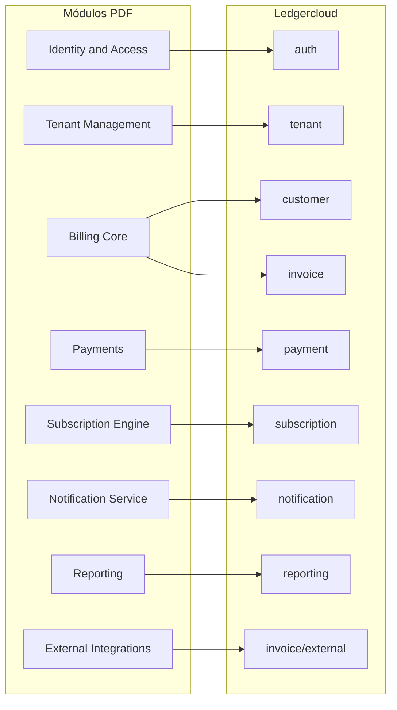

# Plan: Ledgercloud - Plataforma SaaS Multi-Tenant de Facturación Electrónica

Basado en [docs/Proyecto Saa S Facturación Multi-tenant.pdf](docs/Proyecto%20Saa%20S%20Facturación%20Multi-tenant.pdf).

---

## Estado actual vs especificación


| Especificación PDF              | Ledgercloud actual           | Acción          |
| ------------------------------- | ---------------------------- | --------------- |
| Modular Monolith                | Estructura modular existente | Mantener        |
| tenant, auth, customer, invoice | Paquetes creados (vacíos)    | Implementar     |
| payment, subscription, plan     | No existen                   | Crear módulos   |
| notification, reporting         | No existen                   | Crear módulos   |
| JWT + RBAC                      | Spring Security básico       | Extender        |
| Event-driven (RabbitMQ)         | Dependencia presente         | Implementar     |
| Redis cache                     | Dependencia presente         | Implementar     |
| DIAN sandbox                    | Paquete external en invoice  | Implementar     |
| Optimistic locking              | No                           | Añadir @Version |
| Dockerfile                      | No                           | Crear           |


---

## Mapeo de módulos PDF a estructura Ledgercloud




---

## Fase 1 - Base (prioridad inmediata)

### 1.1 Config + Shared base

- [config/DatabaseConfig.java](src/main/java/com/ledgercloud/config/) - JPA, datasource
- [config/RabbitConfig.java](src/main/java/com/ledgercloud/config/) - RabbitMQ
- [config/RedisConfig.java](src/main/java/com/ledgercloud/config/) - Cache
- [config/OpenApiConfig.java](src/main/java/com/ledgercloud/config/) - Swagger
- [shared/exceptions/BusinessException.java](src/main/java/com/ledgercloud/shared/exceptions/)
- [shared/exceptions/GlobalExceptionHandler.java](src/main/java/com/ledgercloud/shared/exceptions/)

### 1.2 Seguridad (JWT + RBAC)

- [shared/security/JwtService.java](src/main/java/com/ledgercloud/shared/security/) - Generación/validación JWT
- [shared/security/SecurityConfig.java](src/main/java/com/ledgercloud/shared/security/) - Reglas, CORS
- RBAC: Owner, Admin, Accountant, Viewer (enum + @PreAuthorize)
- BCrypt para passwords (Spring Security ya lo incluye)

### 1.3 Módulo Tenant

- Domain: Tenant, TenantStatus
- Application: CreateTenantUseCase, GetTenantUseCase
- Infrastructure: TenantEntity, JpaTenantRepository
- [shared/tenancy/TenantContext.java](src/main/java/com/ledgercloud/shared/tenancy/)
- [shared/tenancy/TenantFilter.java](src/main/java/com/ledgercloud/shared/tenancy/)

**Estrategia multi-tenant:** El PDF recomienda "Database per tenant" (ideal) o "Schema por tenant". La estructura actual usa discriminador por columna. Para impresionar: evaluar schema-per-tenant como siguiente paso tras validar con columna.

### 1.4 Módulo Auth (Identity & Access)

- Domain: User, Role (enum: OWNER, ADMIN, ACCOUNTANT, VIEWER)
- User con tenantId, roles
- Application: LoginUseCase, RegisterUserUseCase
- Integración JWT con TenantContext (claims: userId, tenantId, role)

---

## Fase 2 - Billing Core

### 2.1 Módulo Customer

- Domain: Customer, CustomerStatus
- Application: CreateCustomerUseCase, ListCustomersUseCase
- Web: CustomerView (Vaadin), CustomerController (REST)
- Event: CustomerCreatedEvent

### 2.2 Módulo Invoice

- Domain: Invoice (estados: DRAFT, ISSUED, PAID, OVERDUE), InvoiceItem, InvoiceStatus
- Domain rico: `invoice.cancel()`, `invoice.markAsPaid()`, `invoice.issue()`
- Cálculo de impuestos en domain
- Application: CreateInvoiceUseCase, SendInvoiceUseCase, CancelInvoiceUseCase
- Infrastructure: InvoiceEventPublisher (RabbitMQ)
- Eventos: InvoiceCreatedEvent, InvoicePaidEvent
- Optimistic locking: @Version en InvoiceEntity

---

## Fase 3 - Lógica avanzada

### 3.1 Módulo Payment (nuevo)

Crear estructura:

```
modules/payment/
├── domain/model/     (Payment, PaymentStatus)
├── domain/repository/
├── domain/events/    (PaymentReceivedEvent)
├── application/usecase/
├── infrastructure/persistence/
└── web/
```

- Payment vinculado a Invoice
- Reintentos de pago (lógica en domain)
- Evento PaymentReceivedEvent → actualiza Invoice, dispara notificación

### 3.2 Módulo Subscription (nuevo)

```
modules/subscription/
├── domain/model/     (Subscription, Plan)
├── domain/repository/
├── domain/service/   (prorrateo)
├── application/usecase/
├── infrastructure/
└── web/
```

- Plan: definición de precios
- Subscription: plan recurrente por customer
- Prorrateo de suscripciones (lógica avanzada)
- Generación automática de facturas (cron o evento)

### 3.3 Extender Invoice

- Estados completos: draft → issued → paid / overdue
- Cálculo de impuestos por tenant (configuración en Tenant)
- Integración con Payment (InvoicePaidEvent)

---

## Fase 4 - Eventos y notificaciones

### 4.1 Arquitectura orientada a eventos

Flujo ejemplo:

```
InvoiceCreatedEvent → RabbitMQ →
  ├── Generar PDF (handler)
  ├── Enviar email (NotificationService)
  ├── Webhook (si configurado)
  └── Actualizar métricas (Reporting)
```

### 4.2 Módulo Notification

```
modules/notification/
├── domain/model/     (Notification, NotificationType)
├── application/usecase/
├── infrastructure/    (email client, RabbitMQ listener)
└── web/
```

- Listener de InvoiceCreatedEvent, PaymentReceivedEvent
- Envío de emails (configurar servicio externo o mock)
- Notificaciones in-app (opcional)

---

## Fase 5 - Infraestructura

### 5.1 Docker

- [Dockerfile](Dockerfile) - Imagen de la aplicación
- Actualizar [compose.yaml](compose.yaml) - Incluir app, healthchecks

### 5.2 CI/CD (opcional, diferenciador)

- GitHub Actions: build, test, (deploy)
- Testcontainers en CI para PostgreSQL, RabbitMQ

### 5.3 Deploy

- Render, Railway, Fly.io o AWS (según preferencia)

---

## Fase 6 - Integración externa

### 6.1 DIAN Sandbox

- [modules/invoice/infrastructure/external/DianClient.java](src/main/java/com/ledgercloud/modules/invoice/infrastructure/external/)
- Cliente Feign o RestTemplate
- Endpoint sandbox DIAN para facturación electrónica Colombia
- No tiene que ser perfecto: demostrar capacidad de integración

### 6.2 Opcionales

- Stripe/PayPal para pagos
- Servicio de emails (SendGrid, etc.)

---

## Panel Vaadin (todas las fases)

Construir vistas progresivamente:


| Vista                                                 | Módulo       | Fase |
| ----------------------------------------------------- | ------------ | ---- |
| Login                                                 | auth         | 1    |
| Dashboard (ingresos, facturas pendientes, MRR, churn) | reporting    | 4-5  |
| Clientes                                              | customer     | 2    |
| Facturación                                           | invoice      | 2    |
| Suscripciones                                         | subscription | 3    |
| Reportes                                              | reporting    | 4    |
| Usuarios (por tenant)                                 | auth         | 1    |


---

## Features diferenciadores (Top 10%)

Priorizar para impresionar:

1. **Event-driven** - RabbitMQ, eventos de dominio
2. **Multi-tenancy real** - TenantContext, filtro, aislamiento
3. **Optimistic locking** - @Version en entidades críticas
4. **Cache Redis** - Cache de métricas, configuración tenant
5. **Auditoría** - Registro de acciones sensibles (opcional)
6. **Exportación PDF** - Facturas en PDF (handler de evento)

---

## Testing

- Domain: tests unitarios puros (sin Spring)
- Application: tests con mocks
- Infrastructure: Testcontainers (PostgreSQL, RabbitMQ)
- Integración: @SpringBootTest con perfiles

---

## Documentación para el repo

- README con arquitectura, diagramas, stack
- Diagrama C4 (Context, Container)
- ERD del modelo de datos
- Decisiones técnicas y tradeoffs en docs/

---

## Dependencias a añadir (si faltan)

- springdoc-openapi o springfox para Swagger
- jjwt para JWT (o usar spring-security-oauth2-resource-server)
- PDF: OpenPDF, iText o similar para generación

---

## Orden de ejecución recomendado

1. Fase 1 completa (Config, Shared, Security, Tenant, Auth)
2. Fase 2 (Customer, Invoice con estados e impuestos)
3. Fase 3 (Payment, Subscription, lógica avanzada)
4. Fase 4 (Eventos, Notification)
5. Fase 5 (Docker, CI/CD)
6. Fase 6 (DIAN)

Cada fase debe dejar el sistema funcional y testeado antes de avanzar.