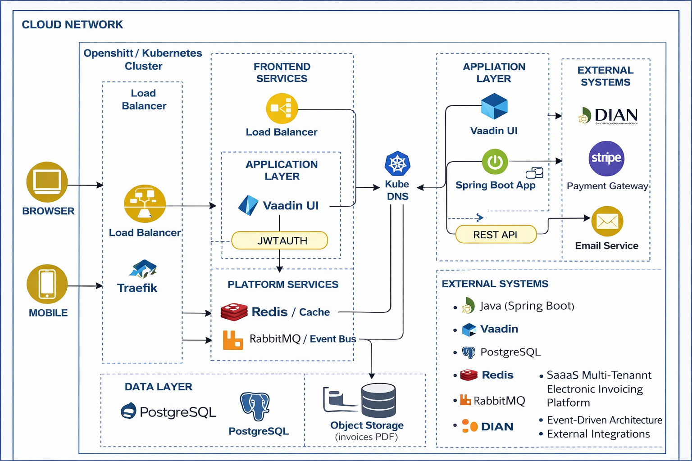

# Ledgercloud

Plataforma SaaS multi-tenant de facturación electrónica construida con Java y Spring Boot. Permite a múltiples empresas gestionar facturación, clientes, suscripciones y pagos desde un único sistema seguro y escalable.

## Descripción

Ledgercloud es un proyecto de demostración de arquitectura empresarial moderna: Clean Architecture, Domain-Driven Design y Modular Monolith. Diseñado para soportar múltiples organizaciones con aislamiento de datos, arquitectura orientada a eventos, control de concurrencia e integración con servicios externos para gestión fiscal.

## Arquitectura



La arquitectura sigue los principios de **Clean Architecture** y **DDD**:

| Capa | Responsabilidad |
|------|-----------------|
| **domain** | Negocio puro. Reglas, estados, validaciones. Sin dependencias de frameworks. |
| **application** | Casos de uso. Orquesta la lógica de dominio. |
| **infrastructure** | JPA, Redis, RabbitMQ, APIs externas. Implementa los adapters. |
| **web** | Controllers REST y vistas Vaadin. Punto de entrada al sistema. |

Ver [docs/ARCHITECTURE.md](docs/ARCHITECTURE.md) para el detalle completo.

## Módulos

- **tenant** — Gestión de organizaciones (multi-tenancy)
- **auth** — Identidad y acceso (JWT, RBAC)
- **customer** — Clientes de cada empresa
- **invoice** — Facturación electrónica
- **payment** — Pagos (en desarrollo)
- **subscription** — Suscripciones recurrentes (en desarrollo)

## Stack tecnológico

- **Backend:** Java 21, Spring Boot 4, Spring Security, Spring Data JPA
- **UI:** Vaadin 25
- **Base de datos:** PostgreSQL
- **Infraestructura:** Docker, Docker Compose, RabbitMQ, Redis
- **Testing:** JUnit, Testcontainers, Mockito
- **API:** OpenAPI / Swagger

## Requisitos

- Java 21
- Maven 3.9+
- Docker y Docker Compose (para PostgreSQL, RabbitMQ, Redis)

## Ejecución

```bash
# Con Docker Compose (PostgreSQL, RabbitMQ, Redis)
docker compose up -d

# Ejecutar la aplicación
./mvnw spring-boot:run
```

La aplicación estará disponible en `http://localhost:8080`.

## Estructura del proyecto

```
com.ledgercloud
├── config/          # Configuraciones globales
├── shared/          # Security, exceptions, tenancy, util
├── modules/
│   ├── tenant/
│   ├── auth/
│   ├── customer/
│   ├── invoice/
│   └── ...
└── ledgercloud/
    └── LedgercloudApplication.java
```

## Documentación

- [Arquitectura detallada](docs/ARCHITECTURE.md)
- [Especificación del proyecto](docs/Proyecto%20Saa%20S%20Facturación%20Multi-tenant.pdf)

## Licencia

Proyecto de demostración.
